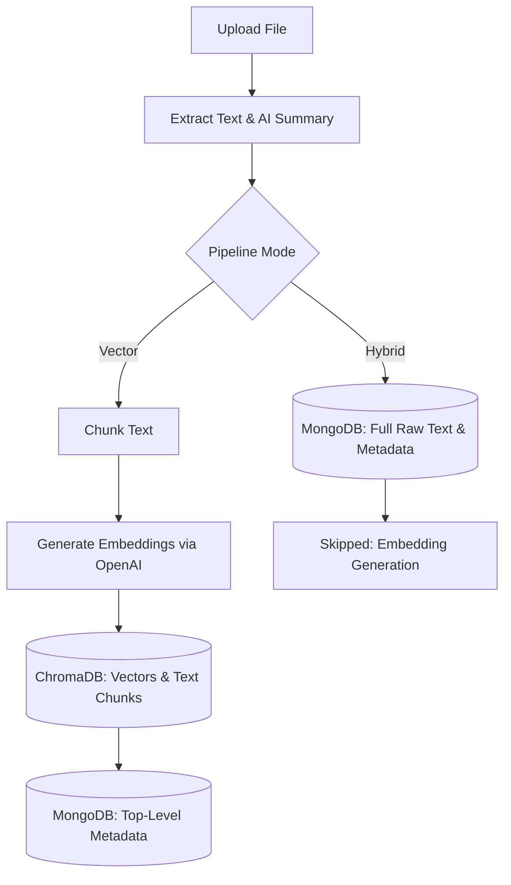
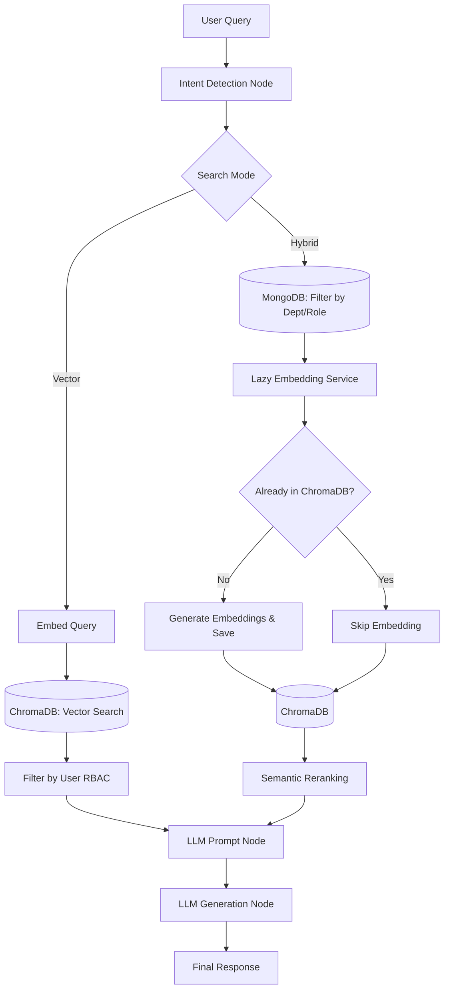

# Corporate Onboarding & Training Backend

An enterprise-grade, SOLID-principled backend designed to ingest corporate knowledge and surface it via an advanced, role-secured Hybrid Search pipeline orchestrated with LangGraph.

## Architecture

This project is built using Clean Architecture and the Repository Pattern, heavily leveraging Dependency Injection across its services.

*   **FastAPI**: Provides a lightning-fast, async web framework.
*   **MongoDB**: Serves as the primary metadata store and document registry, utilizing custom motor async models (`MongoBaseModel`) for automatic indexing and timestamping.
*   **ChromaDB**: A local vector database used for semantic similarity search.
*   **OpenAI / LangChain**: Powers the embeddings, summarization, tagging, and the LLM judge.
*   **LangGraph**: Orchestrates the entire RAG pipeline into a dynamic graph (Intent Detection -> Search -> QA -> Evaluation -> Response).

## Features

1.  **JWT Authentication & RBAC**: Secure endpoints where user roles dictate what documents they can upload and query.
2.  **Dual Ingestion Pipelines**:
    *   **Vector**: Automatically extracts text (using PyMuPDF, PaddleOCR, Whisper), generates chunks/embeddings, and pushes to ChromaDB.
    *   **Hybrid**: Extracts text and metadata but skips embedding generation to save costs.
3.  **Lazy Embedding**: A highly optimized feature for the Hybrid pipeline. When a user queries a hybrid document for the first time, the `LazyEmbeddingService` chunks and embeds it on-the-fly, storing it in ChromaDB for subsequent lightning-fast retrievals.
4.  **LangGraph RAG**:
    *   **Intent Detection**: Routes queries based on their semantic intent.
    *   **Metadata + Semantic Search**: Narrows candidates via MongoDB, then ranks them via ChromaDB.
    *   **Evaluation Guardrails**: An LLM-as-a-judge node evaluates the final response to prevent hallucinations.
5.  **Extensive Metrics**: Every API response includes detailed latency metrics (`embedding_time_ms`, `retrieval_time_ms`) and token usage metrics straight from OpenAI.

## Setup Instructions

1.  **Install Dependencies**
    Ensure you have Python 3.9+ and system packages like `ffmpeg` (for Whisper) installed.
    ```bash
    cd backend
    pip install -r requirements.txt
    ```

2.  **Environment Variables**
    Copy the sample configuration file and populate your MongoDB and OpenAI credentials:
    ```bash
    cd backend
    cp .env.example .env
    ```

3.  **Run the Server**
    Start the FastAPI application with hot-reloading enabled.
    ```bash
    cd backend
    uvicorn main:app --reload
    ```

4.  **Explore the API**
    Navigate to `http://localhost:8000/docs` to interact with the auto-generated Swagger UI. A default admin user (`admin@example.com` / `admin`) is seeded into the database on startup for immediate testing.

---

## API Architecture Flow

This section outlines how the FastAPI routes connect with the MongoDB registry, ChromaDB vector store, and LangGraph pipeline.

### 1. Authentication & Role-Based Access Control (RBAC) Flow
The system enforces strict RBAC logic through dependency injection. 
* **`POST /auth/login`**: Frontend sends credentials. `AuthService` queries MongoDB (`users` collection) to verify. Upon success, returns a JWT containing the user's email and role (e.g. admin, hr, technical_manager).
* **`POST /admin/users` & `GET /admin/users`**: Requests are intercepted by the `RequireRole([Role.ADMIN])` dependency. The `get_current_user` dependency decrypts the JWT and verifies the user exists before executing the operation.

### 2. Knowledge Ingestion Pipeline Flow
Restricted to `Admin`, `HR`, `Finance Manager`, and `Technical Manager` roles.



* **`POST /upload/vector`**: Receives a file, extracts text, chunks it, and immediately calls OpenAI embeddings API to vectorize every chunk. Stores the vectors and text chunks in ChromaDB, and registers the top-level document metadata in MongoDB.
* **`POST /upload/hybrid`**: Extracts the text, but **bypasses embedding generation** to save token costs. Stores the raw extracted text directly in MongoDB alongside the metadata (`mode: hybrid`).

### 3. LangGraph RAG Search Flow
Available to all authenticated users. Orchestrated by the `build_search_graph()` LangGraph workflow.



* **`POST /search/vector`**: Analyzes intent -> Embeds the user query -> Queries ChromaDB using semantic similarity -> Filters out chunks that do not match the user's role/department access level -> Formats retrieved chunks into an LLM context window -> Generates the final synthesized answer.
* **`POST /search/hybrid`**: Analyzes intent -> Filters MongoDB documents matching the user's department/role -> **Lazy Embeds** the narrowed down list of hybrid documents (if they don't already exist in ChromaDB) -> Uses ChromaDB to rerank the now-embedded chunks -> Prompts LLM.

### 4. Monitoring & Telemetry Flow
* **`GET /monitoring/traces`**: The frontend dashboard polls this endpoint to populate trace metrics. Authenticates the user via the JWT token, then acts as a proxy, making an outbound HTTPS call to the Langfuse Cloud API (`GET /api/public/traces`) using injected credentials from `.env`. Returns raw execution traces back to the UI.
