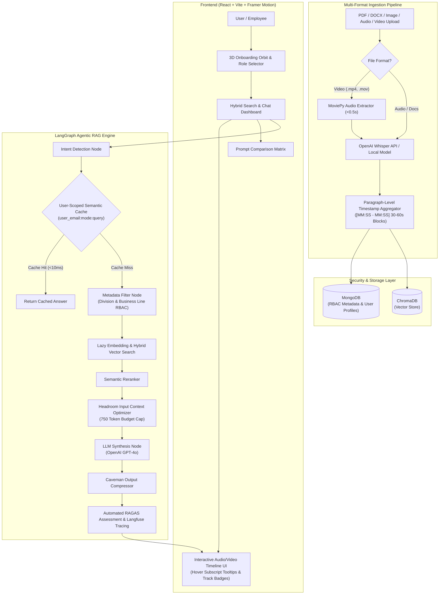

# Architecture Diagram Prompts & Mermaid Code

This file provides both **Mermaid.js code** (for instant diagram rendering & PNG export) and an **AI Graphic Generation Prompt** (for Napkin.ai, Eraser.io, DALL-E 3, or Gamma).

---

## 🛠️ How to Generate & Export Image from Mermaid.js Code

### Method 1: Mermaid Live Editor (Recommended for HD PNG/SVG Export)
1. Copy the **Mermaid.js Code** from Section 1 below.
2. Open **[mermaid.live](https://mermaid.live)** in your browser.
3. Paste the code into the left code editor window.
4. Click **Actions / Export** at the bottom left:
   - Select **PNG (High Res)** or **SVG** to download an image file.
5. Drag and drop the downloaded PNG into **Gamma App** or your PowerPoint presentation!

### Method 2: Eraser.io / Napkin.ai / Notion / GitHub
- Simply paste the ` ```mermaid ` block directly into **Notion**, **GitHub README**, or **Eraser.io**, and it will render instantly as a live vector diagram.

---

## 1. Mermaid.js Diagram Code



---

## 2. AI Graphic Generator Prompt (For Napkin.ai / Eraser.io / DALL-E 3 / Midjourney)

Copy and paste the text block below into AI visual tools like **Napkin.ai**, **Eraser.io**, **DALL-E 3**, or **Gamma Image Generator**:

```text
A futuristic 3D high-tech system architecture diagram for an enterprise Agentic AI platform called "Corporate Onboarding & Training Intelligence Hub". 

Visual Style: Isometric 3D dark-mode tech schematic, neon indigo, glowing electric cyan, purple gradient wires, floating glassmorphic nodes, holographic cybernetic UI style, clean technical layout on dark grid background.

Key Flow Layers & Connected Nodes:
1. FRONTEND LAYER (Top): User Client -> 3D Onboarding Orbit Screen -> Hybrid Search Dashboard -> Interactive Audio/Video Timeline Citation UI.
2. INGESTION PIPELINE (Left): File Ingestion (PDF, DOCX, Audio, Video) -> MoviePy Audio Track Extractor -> Whisper Speech-to-Text -> Paragraph Timestamp Aggregator ([MM:SS - MM:SS]).
3. DUAL STORAGE & RBAC LAYER (Center): MongoDB (Metadata & Division RBAC) + ChromaDB (Vector Index) connected with glowing security firewalls.
4. LANGGRAPH AGENTIC RAG ENGINE (Right): Intent Routing Node -> User-Scoped Semantic Cache (user_email:query) -> Lazy Embedding Engine -> Headroom Context Optimizer -> GPT-4o LLM -> Caveman Compression -> RAGAS Quality Assessor & Langfuse Tracing.

Text Annotations: Clear neon glowing text labels for "LangGraph RAG", "MoviePy", "Whisper", "Division RBAC", "User-Scoped Cache", "Headroom & Caveman", "RAGAS Metrics".
```
