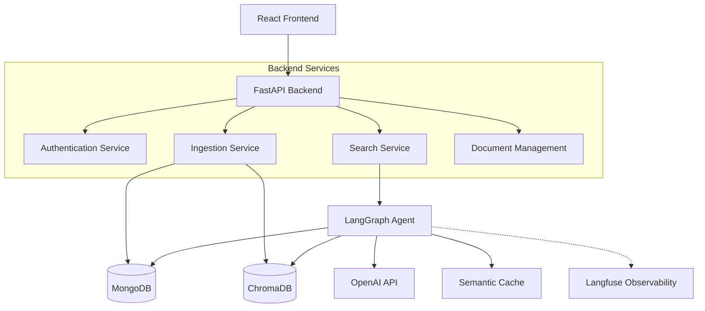
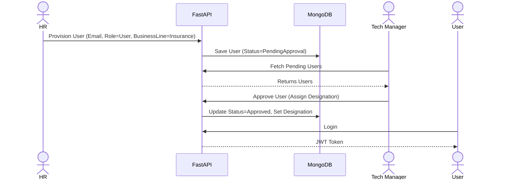
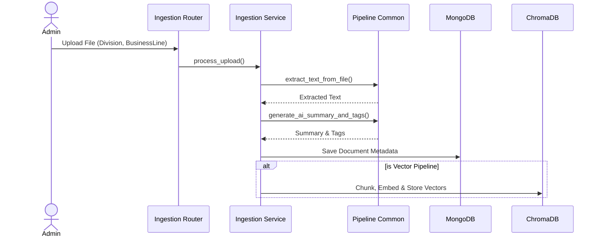
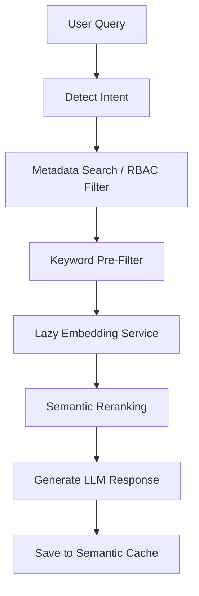
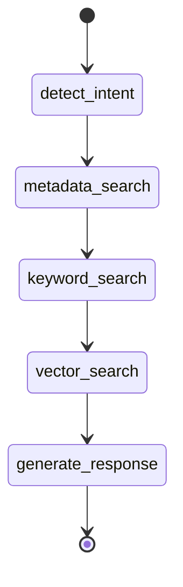

# Technical Design Document (TDD)

## 1. Executive Summary

### Project Overview
The Corporate Onboarding & Training platform is an AI-powered Knowledge Management and Search system designed to facilitate intelligent document retrieval, employee onboarding, and policy management.

### Business Problem
Organizations face challenges in managing fragmented knowledge bases, enforcing strict access controls across different business units, and providing accurate, contextual answers to employee queries. Traditional keyword search lacks contextual understanding, leading to poor discoverability.

### Solution Overview
An Agentic AI application leveraging RAG (Retrieval-Augmented Generation) powered by LangGraph, FastAPI, and React. The platform ensures strict Division and Business Line access controls while offering both Vector and Hybrid search modes.

### Key Features
- **Agentic RAG Engine**: Context-aware answering using LangGraph.
- **Division-Based Access Control**: Strict RBAC ensuring users only see documents they are authorized to view.
- **Hybrid & Vector Search**: Flexible retrieval mechanisms.
- **Rich User Management**: HR/Admin workflows for approving and designating employees.
- **Semantic Caching**: Per-user vector response caching to reduce LLM latency and API costs by up to 90%.
- **RAGAS Evaluation**: Built-in automated metrics (Faithfulness, Answer Relevancy, Context Precision) to evaluate response quality in real-time.
- **Full Traceability**: Langfuse integration for observability.

### Technology Stack
- **Frontend**: React (TypeScript), TailwindCSS, Lucide Icons
- **Backend**: FastAPI (Python), LangGraph, Langchain
- **Databases**: MongoDB (Document/Metadata Storage), ChromaDB (Vector Index)
- **AI/LLM**: OpenAI (GPT models, Embeddings)
- **Observability**: Langfuse

### Design Principles
- **Security-First**: Enforced RBAC at the DB, Vector, and Router layers.
- **Modularity**: Separation of concerns via Service, Repository, and Controller (Router) patterns.
- **Performance**: Lazy embedding generation, semantic caching, and strict metadata pre-filtering.

---

## 2. System Architecture

The architecture consists of a React frontend communicating with a FastAPI backend. The backend orchestrates data across MongoDB and ChromaDB, utilizing LangGraph for intelligent query processing.

---

## 3. Functional Modules

### Authentication
- **Purpose**: Secure access to the platform.
- **Components**: JWT generation/validation, bcrypt password hashing.

### User Administration
- **Purpose**: Manage the lifecycle of users (Creation, Approval, Rejection).
- **Components**: Admin table, HR provisioning, technical manager approval workflows.

### Knowledge Upload
- **Purpose**: Ingest files into the system.
- **Components**: Multi-modal upload (PDF, Audio, etc.), Metadata Tagging, OCR/Whisper extraction, Chunking, Embedding.

### Policy Hub
- **Purpose**: Centralized view of all available knowledge.
- **Components**: Paginated table, Document preview, Metadata filtering.

### Chat/Search
- **Purpose**: Conversational interface for querying knowledge.
- **Components**: Vector/Hybrid mode toggle, Citation generation, LangGraph execution.

### Observability & Evaluation (Langfuse & RAGAS)
- **Purpose**: Observability, performance tracking, and response quality assessment.
- **Components**: Langfuse dashboard for traces/spans, automated RAGAS metrics (Faithfulness, Relevance, Precision) evaluated on each generation.

---

## 4. User Roles & RBAC

The system employs a multi-tiered RBAC model structured around **Divisions** (`Corporate` vs `BusinessLine`).

| Role | Division | Access Permissions | User Admin Capabilities |
|------|----------|-------------------|-------------------------|
| **Admin** | Corporate | Global access to all documents. | Full user management. |
| **HR** | Corporate | Corporate + All Business Lines (Provisioning). | Create any user. |
| **Tech Manager**| BusinessLine | Corporate + Own Business Line. | Approve pending users in own line. |
| **Finance Mgr**| Corporate | Corporate only. | View users. |
| **User** | BusinessLine | Corporate + Own Business Line. | Read-only search. |

---

## 5. User Onboarding Workflow

---

## 6. Knowledge Upload Flow

The platform supports two ingestion pipelines: **Vector** and **Hybrid**.

---

## 7. Knowledge Retrieval Flow

### Vector Search Workflow
The standard Vector Search follows a deterministic LangGraph pipeline:
1. **API Entry & Semantic Caching**: The frontend calls `POST /search/vector`. The system checks `SemanticCacheService` using `user.email`. If cosine similarity > 0.92, it returns the cached response instantly.
2. **LangGraph Pipeline Initialization**: If no cache hit, the LangGraph orchestrator is triggered.
3. **Graph Node Execution**:
   - **`detect_intent`**: Classifies query (e.g., 'policy', 'technical', 'general').
   - **`metadata_search` & `keyword_search`**: Skipped entirely for "vector" mode.
   - **`vector_search`**: 
     - Generates embedding via OpenAI (`text-embedding-3-small`).
     - Constructs dynamic RBAC filter (`{"$or": [{"division": "Corporate"}, {"businessLine": user.businessLine}]}`).
     - Queries ChromaDB using ANN search for top K matching chunks.
4. **Answer Generation & Citations**:
   - **`generate_response`**: Synthesizes the final answer using an LLM and extracts metadata into structured Citations.
5. **Finalization**: Saves the response back to `SemanticCacheService` and logs to Langfuse.

### Hybrid Search Workflow
Hybrid Search employs strict metadata pre-filtering, falling back to vector semantics if keywords yield results, paired with lazy embeddings.

---

## 8. LangGraph Workflow

The conversational engine uses a deterministic graph to ensure repeatable retrieval pipelines.

---

## 9. Database Design

### MongoDB Collections

1. **Users**
   - Fields: `email`, `hashed_password`, `role`, `division`, `businessLine`, `status`
   - Indexes: `email` (Unique)
2. **Documents**
   - Fields: `filename`, `file_path`, `division`, `businessLine`, `ai_summary`, `ai_tags`
   - Indexes: `created_at`, `division`
3. **DocumentChunks**
   - Fields: `document_id`, `text`, `vector_id`

### ChromaDB
- **Collections**: Default vector store.
- **Metadata**: `document_id`, `division`, `businessLine`.

---

## 10. Search Architecture

- **Vector Store**: ChromaDB is used for persistence and ANN (Approximate Nearest Neighbor) search. (Note: FAISS was replaced by ChromaDB in this architecture).
- **Metadata Filtering**: Native MongoDB queries limit the `candidate_docs` pool based on strict RBAC rules before any vector comparison occurs.
- **Lazy Embedding**: To save costs, text chunks are only embedded if they survive the metadata/keyword filtering stages.

---

## 11. API Design

### Authentication
- `POST /auth/login`: Authenticates and returns JWT.
- `GET /auth/me`: Validates token and returns user profile.

### User Administration
- `POST /auth/users`: Provision a new user.
- `GET /auth/users`: List users (filtered by RBAC).
- `PATCH /auth/users/{user_id}/approve`: Approve user.

### Knowledge Upload
- `POST /upload/vector`: Ingest file, extract, embed, and store in ChromaDB.
- `POST /upload/hybrid`: Ingest file, extract, and store in MongoDB (embeddings generated lazily on search).

### Search
- `POST /search/vector`: Standard semantic similarity search.
- `POST /search/hybrid`: Metadata-first search.

---

## 12. Security Design

- **Authentication**: Stateless JWTs with expiration.
- **Authorization (RBAC)**: Enforced via FastAPI `Depends(RequireRole(...))` and manual division checks.
- **Semantic Cache Privacy**: The RAG cache key includes `user.email` to prevent cross-user data leakage.
- **Data Isolation**: Document preview APIs validate `division` and `businessLine` before serving file bytes.

---

## 13. Observability & Evaluation (RAGAS)

Integrated tightly with **Langfuse** and the **RAGAS** (RAG Assessment) framework.
- **Traces**: Every LangGraph execution creates a trace.
- **Spans**: Nodes (`vector_search`, `generate_response`) emit individual spans.
- **RAGAS Metrics**: Every generated response is evaluated automatically for:
  - *Faithfulness*: Does the answer strictly adhere to the provided context?
  - *Answer Relevancy*: How well does the answer address the user's prompt?
  - *Context Precision*: Were the retrieved documents highly relevant?
- **Cost & Latency**: Token consumption and processing time are logged to the trace.

---

## 14. Error Handling

- **FastAPI Exception Handlers**: Global catchers for 404 (Not Found) and 403 (Forbidden).
- **Graceful Degradation**: If Semantic Reranking fails, the system falls back to standard keyword/metadata context.
- **Validation**: Pydantic models strictly validate all incoming API payloads.

---

## 15. Configuration

| Environment Variable | Description |
|----------------------|-------------|
| `MONGO_URI` | Connection string for MongoDB. |
| `OPENAI_API_KEY` | Key for LLM and Embedding models. |
| `JWT_SECRET` | Secret for signing auth tokens. |
| `LANGFUSE_PUBLIC_KEY`| Observability public key. |
| `LANGFUSE_SECRET_KEY`| Observability secret key. |

---

## 16. Deployment Architecture

- **Startup**: Managed via Uvicorn (`uvicorn main:app --reload`).
- **File Storage**: Local filesystem (`/uploads/`) used as temporary/permanent blob storage.
- **Database Initialization**: `fix_db.py` or similar scripts run on deployment to seed Admins and schema configurations.

---

## 17. Design Patterns

- **Repository Pattern**: `DocumentRepository` abstracts MongoDB queries away from the routers.
- **Service Layer**: `IngestionService` and `MetadataSearchService` encapsulate business logic.
- **State Machine (Orchestration)**: LangGraph manages the sequential state of the RAG pipeline.

---

## 18. Performance Considerations

- **Semantic Caching**: Reduces LLM generation time by ~90% for repeated queries by the same user (Threshold > 0.92 cosine similarity).
- **Lazy Embedding**: `ensure_embeddings` only calls the OpenAI API for documents that pass the strict metadata pre-filters, saving massive API costs on large knowledge bases.
- **Paging**: Pagination applied at the MongoDB layer for the Policy Hub to handle large datasets.

---

## 19. Assumptions & Limitations

### Assumptions
- Uploaded files are generally textual (PDFs, DOCX).
- The user has valid OpenAI credits.

### Known Limitations
- Local filesystem storage (`/uploads/`) is not scalable for horizontal deployment (needs S3 integration).
- ChromaDB is currently running in local persistent mode; production would require a client/server deployment.

### Future Enhancements
- Integration with AWS S3 for blob storage.
- Expand hybrid search to use a dedicated keyword indexer (e.g., Elasticsearch) instead of regex/substring fallbacks.
- Agentic multi-turn conversation memory (currently stateless single-turn).
