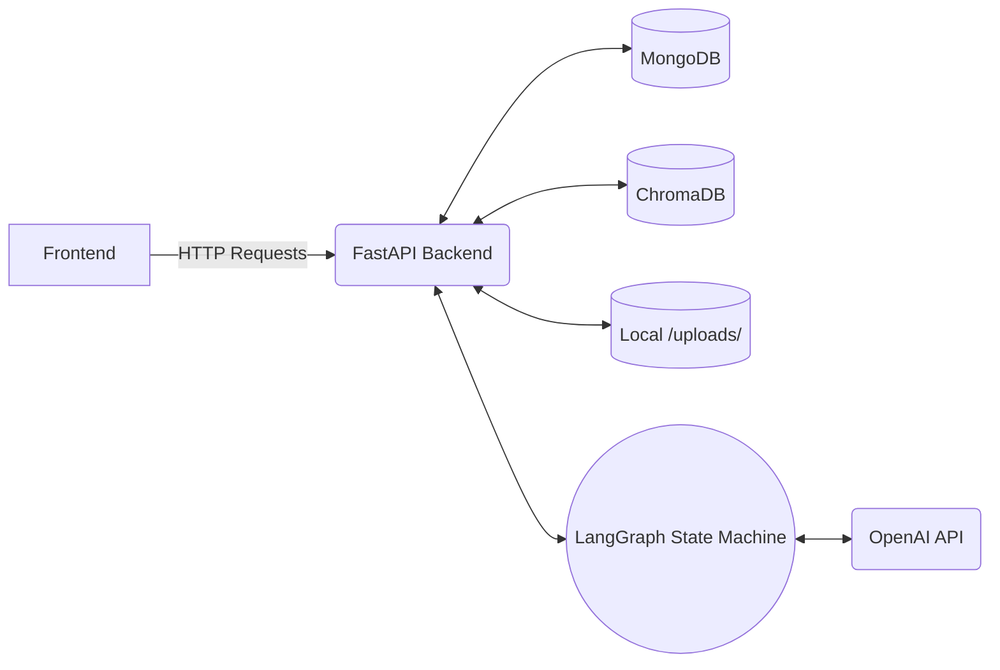
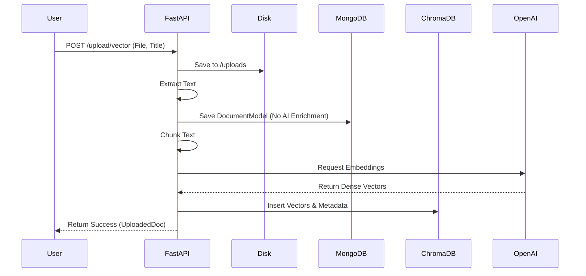
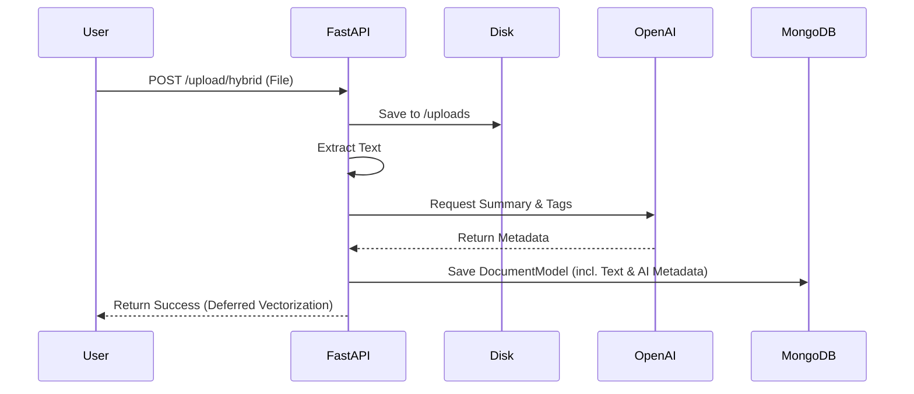
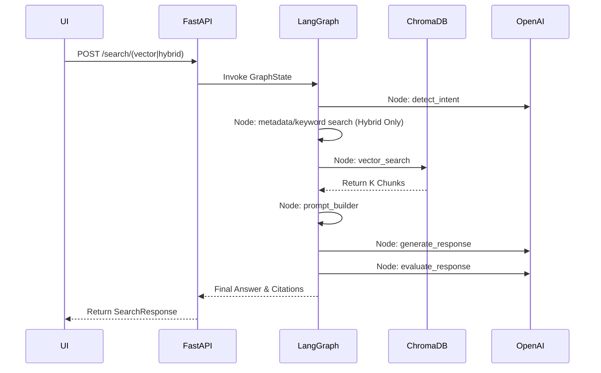

# Knowledge Base Upload & Retrieval Workflows Documentation

## Table of Contents
1. [Knowledge Upload (Ingestion) Flow](#1-knowledge-upload-ingestion-flow)
2. [Knowledge Retrieval Flow](#2-knowledge-retrieval-flow)
3. [LangGraph Workflow](#3-langgraph-workflow)
4. [Data Flow](#4-data-flow)
5. [Sequence Diagrams](#5-sequence-diagrams)
6. [Architecture Diagrams](#6-architecture-diagrams)
7. [API Documentation](#7-api-documentation)
8. [Storage Design](#8-storage-design)
9. [Observability](#9-observability)
10. [Security](#10-security)

---

## 1. Knowledge Upload (Ingestion) Flow

The Ingestion flow handles the intake of unstructured knowledge (PDFs, docs, audio) and structural metadata into the system. The platform exposes two distinct ingestion modes: **Vector Mode** and **Hybrid Mode**.

- **Authentication & Authorization**: Handled via JWT (`Authorization: Bearer <token>`). The user's role (extracted from JWT) dictates the initial metadata.
- **Role-based Metadata Assignment**: `IngestionService` automatically assigns `department` and `knowledge_type` based on the uploader's role. Admins have the explicit ability to override the assigned department.
- **File Validation**: Accepts common document and audio formats (PDF, DOCX, TXT, CSV, MP3, WAV, etc.) with a size limit enforced by the API.
- **File Storage**: Original files are saved to the local `uploads/` directory with a unique UUID.
- **Metadata Extraction & OCR processing**: `extract_text_from_file` employs `PyPDF2` for PDFs, `python-docx` for word docs, and standard string parsing for CSVs and TXTs.
- **Audio Transcription**: Audio formats invoke the **OpenAI Whisper API** (`whisper-1` model) to transcribe the file contents into raw text. *(Note: Video frame extraction is not currently implemented; video files are unsupported or treated as binary downloads).*
- **Hybrid Ingestion Workflow**: 
  - Extracts text.
  - Sends text to an LLM (`generate_ai_summary_and_tags`) to generate a concise summary and tags.
  - Saves the resulting DocumentModel metadata into MongoDB's `documents` collection.
  - **Skips chunking and vector generation** to defer processing costs (Lazy Embedding).
- **Vector Ingestion Workflow**:
  - Extracts text.
  - **Skips AI summary and tag generation** to reduce latency and token costs.
  - Saves DocumentModel to MongoDB.
  - Uses `RecursiveCharacterTextSplitter` (chunk size 1000, overlap 200).
  - Uses OpenAI's embedding models (`text-embedding-3-small`) to generate embeddings.
  - **ChromaDB Indexing**: Saves chunk IDs, embeddings, page content, and metadata to ChromaDB persistent storage. *(Note: FAISS and OpenSearch are not used in this implementation; ChromaDB and MongoDB handle vector and metadata queries respectively).*

---

## 2. Knowledge Retrieval Flow

### Traditional Vector RAG
1. **Request Flow**: `POST /search/vector`.
2. **Query Embedding Generation**: Generates an embedding for the user's query string.
3. **Similarity Search**: Performs an exact k-NN (k-nearest neighbors) query against the pre-populated ChromaDB vector store.
4. **Context Retrieval**: Retrieves the top $K$ semantic chunks.
5. **Prompt Construction**: Concatenates chunks and deduplicates citations based on the document name.
6. **LLM Invocation**: Feeds the context to `ChatOpenAI`.
7. **Evaluation**: Evaluates the LLM response against context to prevent hallucination.
8. **Response Formatting**: Returns JSON with the answer, citations, and execution metrics.

### Hybrid Search + Lazy Embedding
1. **Metadata Filtering**: Queries MongoDB to fetch candidates matching the department and RBAC access roles.
2. **Keyword Search**: Uses strict Python word-matching against the document's AI tags, filename, and AI summary to filter candidates.
3. **Lazy Embedding Generation**: Takes the filtered candidates, extracts their raw text from MongoDB, splits it into chunks, and generates embeddings dynamically on-the-fly.
4. **Semantic Search & Reranking**: Uses `SemanticReranker` to find the most relevant chunks out of the newly embedded document chunks.
5. **Prompt Construction & LLM Invocation**: Same as Vector RAG.

---

## 3. LangGraph Workflow

The retrieval pipeline is orchestrated by a directed acyclic graph built with **LangGraph**.

### Nodes
- **`detect_intent`**: LLM zero-shot classification to categorize the query (policy, technical, general).
- **`metadata_search`**: (Hybrid Only) Queries MongoDB for RBAC/department candidate filtering. Passes `candidate_docs` to state.
- **`keyword_search`**: (Hybrid Only) Drops candidates lacking keyword relevance in tags/filename/summary. 
- **`vector_search`**: Central retrieval node. In Vector mode, queries ChromaDB. In Hybrid mode, invokes `LazyEmbeddingService` and `SemanticReranker`. Passes `retrieved_chunks` to state.
- **`prompt_builder`**: Iterates through chunks to build a single `context_text` string and a deduplicated `citations` array.
- **`generate_response`**: Feeds `context_text` and `query` into the primary LLM to generate `llm_response`.
- **`evaluate_response`**: Safety guardrail. Cross-references the generated answer against the context. If hallucinated ("fail"), overrides `final_answer` with a fallback.

### State Transitions
State object `GraphState` passes metrics, user context, retrieved chunks, and the evolving prompt text between all connected nodes sequentially.

---

## 4. Data Flow

- **Frontend**: Submits multipart forms or JSON to FastAPI endpoints.
- **FastAPI**: Validates JWT and routes requests to `IngestionService` or `nodes.py`.
- **MongoDB**: Stores user accounts, RBAC schemas, and rich document metadata (tags, AI summaries).
- **ChromaDB**: Stores dense vectors (embeddings) and raw chunk text.
- **OpenAI**: Provides transcription (Whisper), embeddings (`text-embedding-3`), summarization/tagging, answer generation, and hallucination evaluation.

---

## 5. Sequence Diagrams

### Vector Document Upload

### Hybrid Document Upload

### Retrieval (Vector & Hybrid)

---

## 6. Architecture Diagrams

### High-level System Architecture

---

## 7. API Documentation

### Knowledge Upload
- **Endpoint**: `POST /upload/vector` or `POST /upload/hybrid`
- **Auth**: `Bearer Token`
- **Request Payload**: Multipart Form Data (`file`: binary, `title`: string, `description`: string, `department`: string)
- **Response**: `UploadedDoc` JSON schema (File details, mode, chunks count).
- **Errors**: `401 Unauthorized` (Invalid JWT), `403 Forbidden` (Insufficient RBAC permissions).

### Semantic Search
- **Endpoint**: `POST /search/vector` or `POST /search/hybrid`
- **Auth**: `Bearer Token`
- **Request Payload**: JSON `{ "query": string, "department": string, "access_roles": string, "top_k": int }`
- **Response**: `SearchResponse` JSON schema (Answer, list of Citations, LangGraph execution path, Metrics).

### Document Management
- **Endpoint**: `GET /documents` (List), `GET /documents/{id}/preview` (Stream File), `DELETE /documents/{id}` (Admin only).

---

## 8. Storage Design

### MongoDB Collections
1. **`users`**: Email, hashed password, enum role, active status.
2. **`documents`**: UUID, filename, local file path, RBAC department, knowledge type, raw text, AI generated tags (List[str]), AI summary, timestamp.

### ChromaDB Index Structure
- **Persistent Collection**: `corporate_knowledge`
- **Embeddings**: Standard floating-point arrays (OpenAI models).
- **Metadata stored per vector**: `document_id`, `chunk_id`, `document_name`, `department`, `version`, `timestamp`.

*(Note: OpenSearch and FAISS are entirely unused in favor of MongoDB and ChromaDB).*

---

## 9. Observability

- **Metrics Object**: Passed through LangGraph state.
- **Latency Measurements**: Timestamps captured across `embedding_time_ms`, `retrieval_time_ms`, and `semantic_search_time_ms`.
- **Token Usage**: Token counts parsed from the `response_metadata` of `ChatOpenAI` calls (`prompt_tokens`, `completion_tokens`, `total_tokens`).
- **Tracing Flow**: Available via the `/monitoring/traces` API endpoint to supply data to the frontend tracing dashboard.

---

## 10. Security

- **Authentication**: JWT generated on `/auth/login`. Tokens are verified on all endpoints via `get_current_user` dependency (header and query parameter fallbacks).
- **RBAC**: Implemented using `RequireRole([Role.ADMIN, Role.HR, etc.])` decorators on sensitive endpoints.
- **Role-based Visibility**: During Hybrid Search, the `metadata_search` LangGraph node explicitly injects the user's encoded role into the MongoDB filter, ensuring that a user can only retrieve candidate documents that match their access level. Admins can bypass this if they supply wildcard explicit access roles.
